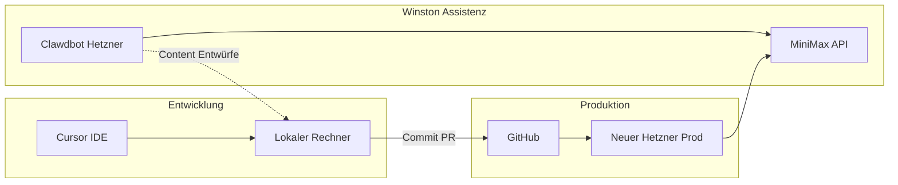
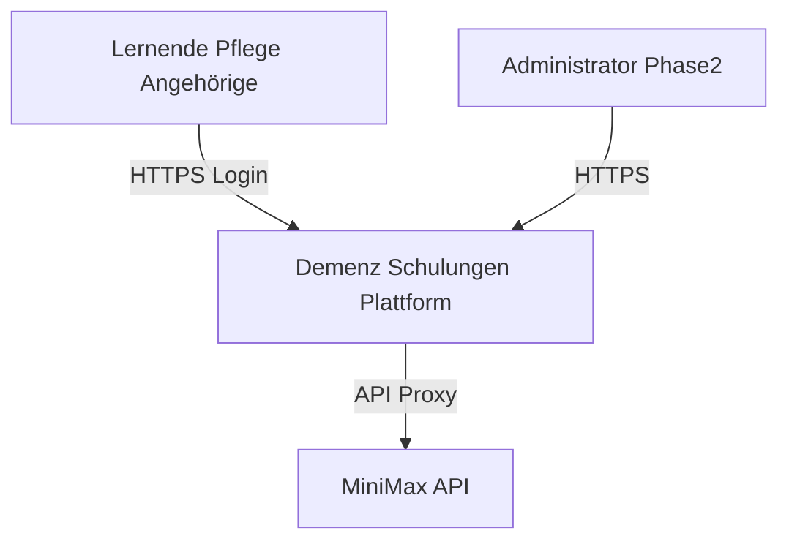
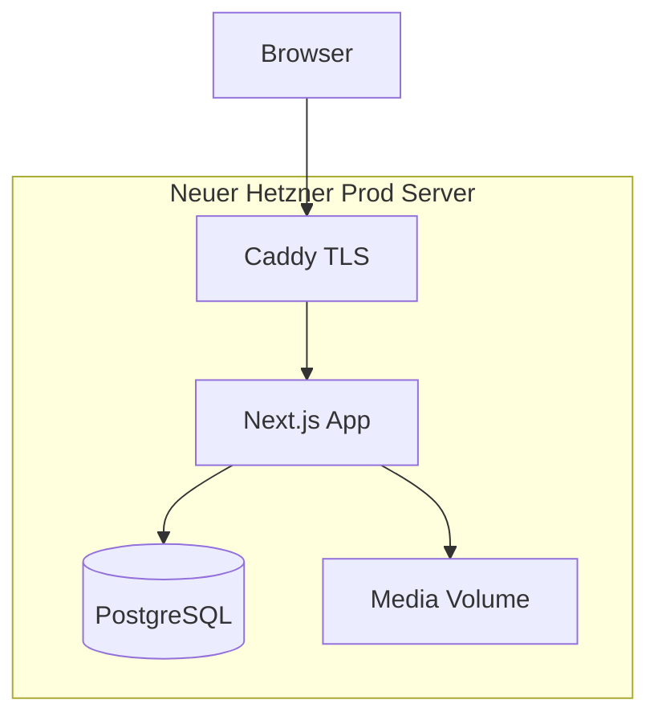

# Architektur — Demenz-Schulungen

> **Version:** 1.0  
> **Datum:** 2026-07-05  
> **Modell:** C4 (vereinfacht)

---

## 1. System-Rollen (drei getrennte Systeme)

| System | Ort | Rolle |
|--------|-----|-------|
| **Cursor** | Lokal (Entwickler-Rechner) | Code, Doku, Review |
| **Winston (Clawdbot)** | Eigener Hetzner-VPS | Content-Assistenz, nur MiniMax |
| **Prod-App** | **Neuer** Hetzner-VPS | Demenz-Schulungen Plattform |

**Nicht Teil dieses Projekts:** Intranet-Server.



---

## 2. C4 Level 1 — System Context



**Externe Akteure:**

- Lernende (Browser, Tablet)
- Administrator (später)
- MiniMax (einzige erlaubte Cloud-API)

---

## 3. C4 Level 2 — Container



| Container | Technologie | Verantwortung |
|-----------|-------------|---------------|
| Caddy | Caddy 2 | TLS, Reverse Proxy, Security Headers |
| Next.js App | Node 20, Next.js 15 | UI, API Routes, MiniMax-Proxy |
| PostgreSQL | Postgres 16 | Users, Courses, Modules, Progress |
| Media Volume | Docker Volume | Video, Audio, Piktogramme |

---

## 4. C4 Level 3 — Komponenten (Next.js App)

| Komponente | Pfad | Aufgabe |
|----------|------|---------|
| Pages | `src/app/` | Routing, Layout |
| UI Components | `src/components/` | Button, Card, PictogramCard, Quiz — siehe [DESIGN-SPEC.md](DESIGN-SPEC.md), [UX-IMPLEMENTATION.md](UX-IMPLEMENTATION.md) |
| API Routes | `src/app/api/` | Progress, Generate (MiniMax) |
| Lib | `src/lib/` | Drizzle, Validierung, MiniMax-Client |
| Content Loader | `src/lib/content/` | `modules/` + `quiz.json` einlesen |

---

## 5. Datenflüsse

### 5.1 Modul abspielen

```
Browser → GET /modules/[id] → Next.js lädt metadata.json + script.md
       → Rendert Frames (Piktogramm, Text, Video, Audio)
       → Quiz aus quiz.json → eigene React-Komponenten
       → POST /api/progress → PostgreSQL
```

### 5.2 Content-Erstellung (Winston)

```
Storyboard (Markdown) → Winston (MiniMax) → Entwürfe
                     → Mensch reviewt → Commit ins Repo
                     → CI Build → Deploy Prod
```

---

## 6. Sicherheitsgrenzen

- MiniMax API-Key: nur Server, nie Client
- Keine PII in MiniMax-Prompts
- Login-Gate (Phase 2) vor allen Lerninhalten
- CSP, HSTS via Caddy

Siehe [SECURITY.md](SECURITY.md), [compliance/DATENSCHUTZKONZEPT.md](compliance/DATENSCHUTZKONZEPT.md).

---

## 7. Referenzen

- [DECISIONS.md](DECISIONS.md)
- [DATA-MODEL.md](DATA-MODEL.md)
- [API-SPEC.md](API-SPEC.md)
- [DEPLOYMENT.md](DEPLOYMENT.md)
- [UX-IMPLEMENTATION.md](UX-IMPLEMENTATION.md)
