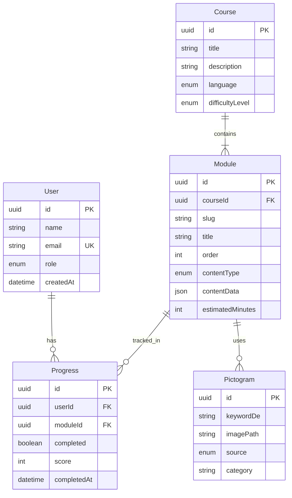

# Datenmodell

> **Version:** 1.0  
> **Datum:** 2026-07-05  
> **ORM:** Drizzle (ADR-013)

---

## 1. ER-Diagramm



---

## 2. Enums (PostgreSQL)

```sql
CREATE TYPE role AS ENUM ('LEARNER', 'INSTRUCTOR', 'ADMIN');
CREATE TYPE language AS ENUM ('DE', 'ES');
CREATE TYPE difficulty_level AS ENUM ('BEGINNER', 'INTERMEDIATE', 'ADVANCED');
CREATE TYPE content_type AS ENUM ('STORYBOARD', 'VIDEO', 'QUIZ');
CREATE TYPE pictogram_source AS ENUM ('MINIMAX', 'MANUAL');
```

---

## 3. Drizzle Schema (Auszug)

```typescript
// src/db/schema.ts
import { pgTable, uuid, text, timestamp, boolean, integer, jsonb, pgEnum } from 'drizzle-orm/pg-core';

export const roleEnum = pgEnum('role', ['LEARNER', 'INSTRUCTOR', 'ADMIN']);

export const users = pgTable('users', {
  id: uuid('id').primaryKey().defaultRandom(),
  name: text('name').notNull(),
  email: text('email').notNull().unique(),
  role: roleEnum('role').default('LEARNER').notNull(),
  createdAt: timestamp('created_at').defaultNow().notNull(),
  updatedAt: timestamp('updated_at').defaultNow().notNull(),
});

export const progress = pgTable('progress', {
  id: uuid('id').primaryKey().defaultRandom(),
  userId: uuid('user_id').references(() => users.id).notNull(),
  moduleId: uuid('module_id').notNull(),
  completed: boolean('completed').default(false).notNull(),
  score: integer('score'),
  completedAt: timestamp('completed_at'),
  createdAt: timestamp('created_at').defaultNow().notNull(),
}, (t) => ({
  userModuleUnique: unique().on(t.userId, t.moduleId),
}));
// … courses, modules, pictograms analog
```

---

## 4. Content vs. DB

| Daten | Speicherort | Begründung |
|-------|-------------|------------|
| Storyboard, Scripts | `modules/` im Repo | Versionierung, Review |
| Quiz-Definition | `modules/*/quiz.json` | Versionierung |
| Medien (MP4, MP3, PNG) | `modules/` oder Media-Volume | Größe, Git LFS |
| Kurs-/Modul-Metadaten | PostgreSQL | Abfragen, Fortschritt |
| Nutzer, Fortschritt | PostgreSQL | Dynamisch |

---

## 5. Migration-Strategie

- `drizzle-kit generate` / `drizzle-kit migrate` für Schema-Änderungen
- Seed-Script für 3 Pilotkurse (Phase 1)
- Keine Breaking Changes ohne ADR + MIGRATION-GUIDE

---

## 6. Referenzen

- [QUIZ-SCHEMA.md](QUIZ-SCHEMA.md)
- [MODULE-TEMPLATE.md](MODULE-TEMPLATE.md)
- [DECISIONS.md](DECISIONS.md) ADR-006
