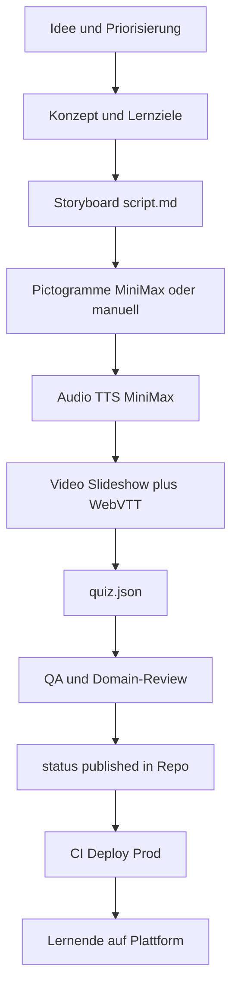
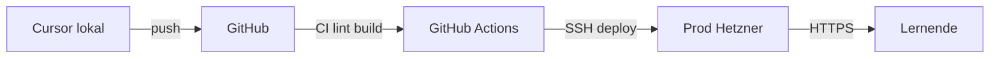

# Prozess- und Verfahrensspezifikation

> **Dokumentenstatus:** Verbindlich  
> **Version:** 2.0  
> **Datum:** 2026-07-05  
> **Maßgeblich mit:** [DECISIONS.md](DECISIONS.md), [CONTENT-SPEC.md](CONTENT-SPEC.md), [MODULE-TEMPLATE.md](MODULE-TEMPLATE.md)

---

## 1. Geltungsbereich

Dieses Dokument beschreibt **alle operativen Prozesse** für Demenz-Schulungen:

- Content-Erstellung (Mensch + Winston/Clawdbot)
- Qualitätssicherung und Freigabe
- Veröffentlichung in der eigenen Plattform
- Betrieb und Änderungsmanagement

**Nicht Geltungsbereich:** Intranet-Server, Prod-App auf separatem Hetzner (siehe [ARCHITECTURE.md](ARCHITECTURE.md)).

**Verworfen (nicht in diesem Workflow):** Moodle, H5P, ARASAAC, Vercel, SCORM in Phase 1.

---

## 2. Systeme und Rollen

| System | Ort | Rolle im Prozess |
|--------|-----|------------------|
| **Cursor** | Lokal (Patrick) | Entwicklung, Review, Git-Commits |
| **Winston (Charlie)** | Hetzner `demenz-prod` (`91.99.99.177`) | Content-Assistenz, nur MiniMax |
| **GitHub** | Cloud | Code, Doku, Module, CI |
| **Prod-App** | Neuer Hetzner-VPS | Lernplattform für Endnutzer |

| Rolle | Wer | Aufgaben |
|-------|-----|----------|
| **Projektinhaber** | Patrick | Freigaben, Betrieb, Domain-Expert-Koordination |
| **Entwicklung** | Cursor + Patrick | Plattform, Validierung, CI |
| **Content-Assistenz** | Winston (Clawdbot) | Entwürfe via MiniMax — **kein Auto-Commit** |
| **Domain-Expert** | Extern | Fachliche Korrektheit der Module |
| **Lernende** | Pflegekräfte, Angehörige | Konsumieren veröffentlichte Module |

Details: [RACI.md](RACI.md)

---

## 3. End-to-End-Pipeline



### 3.1 Stufen im Detail

| Stufe | Input | Output | Verantwortlich |
|-------|-------|--------|----------------|
| 1 Idee | Bedarf, PRD | Priorisiertes Thema | Patrick |
| 2 Konzept | Thema | Lernziele SMART, Zielgruppe | Patrick + Domain-Expert |
| 3 Storyboard | Konzept | `script.md` (Frames) | Patrick / Winston-Entwurf |
| 4 Pictogramme | Storyboard | `pictograms/` PNG/SVG | MiniMax Image-01 oder manuell |
| 5 Audio | Script | `audio/*.mp3` | MiniMax speech-02-hd |
| 6 Video | Frames + Audio | `video/*.mp4` + `.vtt` | FFmpeg / optional Hailuo |
| 7 Quiz | Lernziele | `quiz.json` | Patrick / Winston-Entwurf |
| 8 QA | Komplettes Modul | Freigabe oder Änderungsliste | Domain-Expert + Tech-Check |
| 9 Publish | Freigabe | `metadata.json` → `published` | Patrick |
| 10 Deploy | Git push main | Live auf Prod | CI + Patrick |

### 3.2 Phasenmodell (Projekt)

| Phase | Fokus | Module | Plattform |
|-------|-------|--------|-----------|
| **Phase 1 (MVP)** | 3 Pilotmodule + Basis-App | Hände waschen, Medikamente, Ernährung | Kursübersicht, Player, MC-Quiz, Fortschritt |
| **Phase 2** | Auth, erweiterte Quiz-Typen | Weitere Module | Login, Drag&Drop, SCORM-Export |
| **Phase 3** | Skalierung | Vollständiger Katalog | Reporting, Zertifikate |

Siehe [ROADMAP.md](ROADMAP.md).

---

## 4. Content-Erstellung

### 4.1 Modul anlegen

```bash
modules/{slug}/de/
├── metadata.json
├── script.md
├── quiz.json
├── pictograms/
├── audio/
└── video/
```

Vorlage: [MODULE-TEMPLATE.md](MODULE-TEMPLATE.md). Didaktik: [CONTENT-SPEC.md](CONTENT-SPEC.md).

### 4.2 Storyboard (`script.md`)

- **Sprache:** A2-Niveau (GER), max. 7–10 Wörter pro Satz
- **Struktur:** 1 Frame = 1 Pictogramm + 1 Aussage + 1 Audio-Segment
- **Dauer:** Gesamtmodul 10–15 Minuten Lernzeit

### 4.3 Pictogramme

1. Prompt nach DESIGN-SPEC (flat, max. 3 Farben, hoher Kontrast)
2. Generierung via MiniMax Image-01 **oder** manuelles SVG (Inkscape/Figma)
3. `manifest.json`: `source: minimax | manual`, Alt-Text Pflicht
4. Menschliche Freigabe vor Commit — kein blindes Übernehmen von KI-Output

**Kein ARASAAC.** Siehe ADR-009.

### 4.4 Audio (TTS)

1. Text aus `script.md` segmentieren
2. MiniMax `speech-02-hd`, Tempo ≈ 0.9×
3. MP3 128 kbps in `audio/`
4. **Jedes Segment anhören** vor Commit

### 4.5 Video

**Bevorzugt:** Statische Slideshow (Frames + Audio) via FFmpeg  
**Optional:** MiniMax Hailuo für sanfte Übergänge  
**Pflicht:** WebVTT-Untertitel, manuell korrigiert (Whisper nur als Entwurf)

### 4.6 Quiz (`quiz.json`)

- Schema: [QUIZ-SCHEMA.md](QUIZ-SCHEMA.md)
- Phase 1: Multiple Choice
- Mindestpunktzahl: 80% (konfigurierbar)
- Rendering: eigene React-Komponenten — **kein H5P**

---

## 5. Winston / Clawdbot-Workflow

**Server:** `demenz-prod` (`91.99.99.177`), Bot **Charlie**  
**Policy:** Nur MiniMax — ADR-005

### 5.1 Was Winston darf

| Aufgabe | Output | Review |
|---------|--------|--------|
| Script-Entwürfe | Markdown-Vorschlag | Patrick vor Übernahme in `script.md` |
| Pictogramm-Prompts | Text-Prompts | Patrick vor API-Call |
| Bildgenerierung | PNG-Entwürfe | Patrick vor Commit |
| TTS-Segmentierung | Audio-Dateien | Patrick hört jedes Segment |
| Quiz-Entwürfe | JSON-Vorschlag | Schema-Validierung + Fachreview |

### 5.2 Was Winston nicht darf

- Direkt auf `main` committen ohne Review
- Prod-Server oder Prod-DB berühren
- API-Keys ins Repo schreiben
- Personenbezogene Daten in MiniMax-Prompts

### 5.3 Typischer Ablauf

```
Patrick (Cursor) ── Auftrag an Winston
Winston (Charlie) ── MiniMax-Entwürfe
Patrick ── Review, Anpassung, Commit ins Repo
GitHub Actions ── Validierung (sobald Phase B)
```

Konfiguration: `/root/.clawdbot/clawdbot.json` — siehe [ops/SERVER-PROD.md](ops/SERVER-PROD.md)

---

## 6. KI-Integration (MiniMax only)

| API | Verwendung | Phase |
|-----|------------|-------|
| Text (M2.7) | Scripts, Quiz-Fragen | Content-Erstellung |
| Image-01 | Piktogramme | Content-Erstellung |
| speech-02-hd | TTS | Content-Erstellung |
| Hailuo-02 | Video (optional) | Content-Erstellung |

**Prod-Laufzeit:** Lernende erhalten **statische Assets** aus dem Repo. MiniMax-Proxy (`/api/generate/*`) nur für **Autoren-Tools**, nicht für Endnutzer-Lernflow.

**API-Key:** Von Winston/Intranet-Prod übernehmen — nur in `.env` auf Servern.

**Keine PII** in Prompts. Validierung via Zod auf API-Routes.

---

## 7. Review und QA

### 7.1 Checkliste pro Modul

| Prüfung | Kriterium | Wer |
|---------|-----------|-----|
| Fachlich | Medizinisch/pflegerisch korrekt | Domain-Expert |
| Sprache | A2, kurze Sätze | Patrick |
| Barrierefreiheit | WCAG 2.1 AA, Kontrast, Alt-Text | Tech (Cursor) |
| Schema | `metadata.json`, `quiz.json` valide | CI / `npm run validate:content` |
| Audio | Verständlich, korrekte Aussprache | Patrick |
| Untertitel | WebVTT synchron, korrekt | Patrick |
| Quiz | Alle Fragen lösbar, 80%-Schwelle sinnvoll | Domain-Expert |
| Design | DESIGN-SPEC + UX-IMPLEMENTATION | Tech |

### 7.2 Status-Workflow in `metadata.json`

```
draft → review → published
```

- `draft`: In Arbeit, nicht in Prod sichtbar
- `review`: Bereit für Domain-Expert
- `published`: Freigegeben, in Prod auslieferbar

### 7.3 Definition of Done

Siehe [DEFINITION-OF-DONE.md](DEFINITION-OF-DONE.md) — Abschnitt „Content (pro Modul)“.

---

## 8. Änderungsmanagement

### 8.1 Content-Änderungen

1. Branch oder direkt auf `main` (nach Team-Regel)
2. `metadata.json` → `version` erhöhen (SemVer)
3. CHANGELOG-Eintrag bei user-facing Änderungen
4. Domain-Expert bei fachlichen Änderungen erneut einbinden
5. Deploy über CI (siehe §9)

### 8.2 Breaking Changes

- Quiz-Schema-Änderung → ADR + QUIZ-SCHEMA.md + Migration bestehender Module
- API-Änderung → API-SPEC.md + Versionierung

### 8.3 Rollback

- **Content:** Git revert + Redeploy
- **Plattform:** Docker-Image-Tag oder Git-Tag — siehe [ops/RUNBOOK.md](ops/RUNBOOK.md)

---

## 9. Veröffentlichung und Deployment

### 9.1 Content-Veröffentlichung

Content lebt im **Git-Repo** unter `modules/`. Veröffentlichung = `status: published` + Merge auf `main`.

### 9.2 Plattform-Deployment



Details: [DEPLOYMENT.md](DEPLOYMENT.md), [ops/RUNBOOK.md](ops/RUNBOOK.md)

**Nicht verwendet:** Vercel, Netlify, Moodle-Upload, H5P-Export.

### 9.3 CI-Checks (ab Phase B)

| Check | Wann | Tool |
|-------|------|------|
| Lint + Typecheck | Jeder PR | ESLint, `tsc` |
| Build | Jeder PR | `next build` |
| Content-Schema | Bei Änderung in `modules/` | Zod-Validierung |
| WCAG-Kontrast | Manuell + Lighthouse | DESIGN-SPEC Tokens |
| Deploy Prod | Push `main` | GitHub Actions → SSH |

---

## 10. Mehrsprachigkeit (Phase 2)

| Schritt | Beschreibung |
|---------|--------------|
| 1 | DE-Modul als Master (`modules/{slug}/de/`) |
| 2 | Übersetzung `script.md` + `quiz.json` → `modules/{slug}/es/` |
| 3 | Pictogramme: sprachunabhängig in `shared/` oder neu generieren |
| 4 | TTS in Zielsprache (MiniMax) |
| 5 | Separates Review durch muttersprachlichen Domain-Expert |

Phase 1: nur Deutsch (`de`).

---

## 11. Fehlerbehandlung

| Szenario | Maßnahme |
|----------|----------|
| MiniMax API down | Manuelle Assets nutzen; Modul mit statischen Fallbacks testbar halten |
| Winston liefert schlechten Entwurf | Verwerfen, Prompt anpassen, erneut — kein Auto-Merge |
| Domain-Expert lehnt ab | `status: draft`, Issues dokumentieren |
| Deploy schlägt fehl | Kein Rollforward; vorheriges Image/Tag — RUNBOOK §Rollback |
| Datenpanne | [ops/INCIDENT-RESPONSE.md](ops/INCIDENT-RESPONSE.md) |

---

## 12. Dokumentationsstandards

| Änderung an … | Dokument aktualisieren |
|---------------|------------------------|
| Architektur-Entscheidung | `DECISIONS.md` (neues ADR) |
| API | `API-SPEC.md` |
| Datenmodell | `DATA-MODEL.md` + Drizzle-Migration |
| UI/UX | `DESIGN-SPEC.md`, ggf. `UX-IMPLEMENTATION.md` |
| Prozess | Dieses Dokument |
| Betrieb | `ops/RUNBOOK.md` |
| User-facing Release | `CHANGELOG.md` |

---

## 13. Referenzen

- [CONTENT-SPEC.md](CONTENT-SPEC.md)
- [MODULE-TEMPLATE.md](MODULE-TEMPLATE.md)
- [QUIZ-SCHEMA.md](QUIZ-SCHEMA.md)
- [DEPLOYMENT.md](DEPLOYMENT.md)
- [ops/RUNBOOK.md](ops/RUNBOOK.md)
- [ops/SERVER-PROD.md](ops/SERVER-PROD.md)
- [DECISIONS.md](DECISIONS.md)

---

## Changelog

| Version | Datum | Änderung |
|---------|-------|----------|
| 1.0–1.1 | 2026-07-05 | Initiale Version (teilweise veraltet) |
| 2.0 | 2026-07-05 | Vollständige Neufassung — Selbstbau-Workflow, kein H5P/ARASAAC/Moodle |
