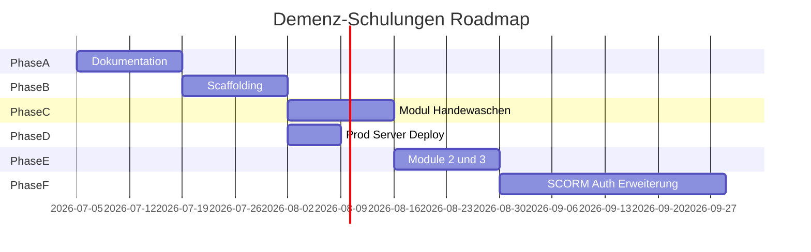

# Roadmap

> **Version:** 1.0  
> **Datum:** 2026-07-05

---

## Übersicht

---

## Phase A — Dokumentation (1–2 Wochen)

- [x] ADRs, Vision, PRD, Architektur
- [x] API, Datenmodell, Quiz-Schema, Content-Spec
- [x] Compliance (Entwurf)
- [x] Specs mit Hinweisen aktualisiert
- [x] GitHub Governance, Cursor Rules
- [ ] Compliance-Freigabe durch Patrick

---

## Phase B — Scaffolding (2 Wochen)

- Next.js 15 + Tailwind + Drizzle
- Design Tokens in Tailwind/globals.css ([UX-IMPLEMENTATION.md](UX-IMPLEMENTATION.md) §6)
- Basis-Komponenten (Button, Card, Nav, PictogramCard)
- Quiz-Komponenten (MC)
- Performance-Budget: LCP < 2.5s, Lighthouse ≥ 90
- MiniMax-Proxy
- Docker Compose, CI

---

## Phase C — Referenzmodul „Hände waschen“ (2 Wochen)

- Storyboard, Piktogramme (MiniMax), TTS, Video, quiz.json
- Domain-Expert-Review

---

## Phase D — Prod-Server (1 Woche, parallel)

- Hetzner VPS, Caddy, Deploy, Backups

---

## Phase E — Module 2+3 + QA (2 Wochen)

- Medikamente, Ernährung
- WCAG-Audit

---

## Phase F — Erweiterungen (ohne Zeitdruck)

- SCORM 2004 Export
- Auth (Login-only)
- Drag&Drop-Quiz
- Zertifikate, Reporting
- ES-Übersetzung

---

## Meilensteine

| Meilenstein | Kriterium | Ziel |
|-------------|-----------|------|
| M1 | Phase A DoD | Doku vollständig |
| M2 | Erster Build grün | CI passing |
| M3 | Modul 1 live | Handewaschen auf Prod |
| M4 | Phase 1 MVP | 3 Module + Plattform |
