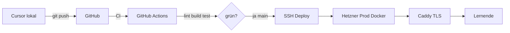

# Technische Spezifikation — Demenz-Schulungen

> **Status:** Verbindlich — ergänzt [DECISIONS.md](DECISIONS.md)  
> **Version:** 1.0  
> **Letzte Änderung:** 2026-07-05  
> **Verantwortlich:** Projektteam Demenz-Schulungen

> **Hinweis:** Bei Widersprüchen gelten [DECISIONS.md](DECISIONS.md) und die spezialisierten Specs (API, DATA-MODEL, DEPLOYMENT, UX-IMPLEMENTATION).

---

## Inhaltsverzeichnis

1. [Überblick](#1-überblick)
2. [Tech-Stack: Aktiv](#2-tech-stack-aktiv)
3. [Tech-Stack: Deaktiviert](#3-tech-stack-deaktiviert)
4. [Technische Constraints](#4-technische-constraints)
5. [Architektur-Entscheidungen](#5-architektur-entscheidungen)
6. [Datenmodell](#6-datenmodell)
7. [API-Design](#7-api-design)
8. [Deployment-Pipeline](#8-deployment-pipeline)
9. [Monitoring & Observability](#9-monitoring--observability)
10. [Security](#10-security)
11. [Offene Fragen](#11-offene-fragen)

---

## 1. Überblick

**Projekt:** Interaktive Demenz-Schulungsplattform für Pflegeeinrichtungen  
**Ziel:** Barrierefreie Schulungen mit Pictogramm-Didaktik, eigene Plattform  
**Nutzer:** Pflegekräfte, Angehörige  
**Kernprinzip:** Self-Host EU, DSGVO-by-design, MiniMax-only KI, kein US-Tracking

---

## 2. Tech-Stack: Aktiv

### 2.1 Frontend

| Technologie | Version | Verwendung | Status |
|-------------|---------|------------|--------|
| **Next.js** | 15.x | App Router, RSC default | ⭐ Pflicht (ADR-003) |
| **TypeScript** | ≥5.0 | Strict Mode | Pflicht |
| **Tailwind CSS** | ≥3.4 | Utility-First, mapped auf DESIGN-SPEC Tokens | Pflicht |
| **Framer Motion** | ≥11.0 | Nur komplexe UI-Transitions (LazyMotion) | Selektiv (ADR-003) |
| **Lucide React** | latest | Icons (MIT, tree-shakeable) | ⭐ Bevorzugt |
| **CSS Animations** | — | Hover, Focus, Progress, Fade-In | Primär (DESIGN-SPEC §8.5) |

> **Rendering:** Server Components für Kursübersicht und Metadaten; Client Components nur für Modul-Player, Quiz, Mobile-Nav. Siehe [UX-IMPLEMENTATION.md](UX-IMPLEMENTATION.md) §4.

### 2.2 Backend

| Technologie | Version | Verwendung | Status |
|-------------|---------|------------|--------|
| **Node.js** | ≥20 LTS | Laufzeitumgebung | ⭐ Bevorzugt |
| **Bun** | ≥1.0 | Alternative Laufzeit (Performance-Vorteile) | Alternative |
| **Next.js API Routes** | — | Backend-Logik (kein separates Backend nötig) | ⭐ Standard |
| **PostgreSQL** | ≥16 | Produktiv-Datenbank (Docker) | ⭐ Produktiv |
| **PostgreSQL** | ≥16 | Lokale Entwicklung (Docker Compose) | ⭐ Dev |
| **Drizzle ORM** | latest | ORM + Migrationen | Pflicht (ADR-013) |

### 2.3 KI / APIs

| Modell / API | Verwendung | Status |
|--------------|------------|--------|
| **MiniMax M2.7** | Textgenerierung, Schulungsinhalte | ⭐ Pflicht |
| **MiniMax Image-01** | Pictogramm-Generierung, Illustrationen | ⭐ Pflicht |
| **MiniMax Hailuo-02** | Video-Generierung | Optional |
| **MiniMax speech-02** | Text-to-Speech (Vorlesen von Texten) | ⭐ Pflicht |
| **MiniMax MCP** | Model Context Protocol für Agent-Integration | ⭐ Pflicht |
| **Clawdbot** | Orchestrierungs-Layer, Automatisierung | ⭐ Pflicht |

> **Hinweis:** OpenAI wird explizit NICHT verwendet (siehe [Tech-Stack: Deaktiviert](#3-tech-stack-deaktiviert)). MiniMax bietet vergleichbare oder bessere Qualität bei niedrigeren Kosten.

### 2.4 Hosting / Infrastruktur

| Dienst | Verwendung | Status |
|--------|------------|--------|
| **Hetzner VPS** | Prod-App (Docker Compose, Caddy) | ⭐ Pflicht (ADR-007) |
| **GitHub Actions** | CI/CD | ⭐ Pflicht |
| **Winston (Clawdbot)** | Content-Assistenz (eigener Hetzner, ≠ Prod) | Assistenz |

> **Verworfen:** Vercel, Netlify, Railway, US-Cloud-Hosting (ADR-007).

### 2.5 Content & Piktogramme

| Quelle | Verwendung | Status |
|--------|------------|--------|
| **MiniMax Image-01** | Piktogramm-Generierung | ⭐ Primär (ADR-009) |
| **Manuelle SVGs** | Piktogramme, Review vor Commit | Sekundär (ADR-009) |
| **quiz.json** | Quiz-Definition im Repo | Pflicht (ADR-011) |
| **Eigene React-Komponenten** | Quiz, Modul-Player | Pflicht (ADR-004) |

> **Verworfen:** ARASAAC, H5P, Moodle (ADR-002, ADR-004, ADR-009). SCORM-Export Phase 2.

### 2.6 Content Pipeline

| Technologie | Verwendung | Status |
|------------|------------|--------|
| **Figma** | Pictogramm-Bearbeitung, UI-Design | ⭐ Bevorzugt |
| **Canva** | Schnelle Grafik-Erstellung | Alternative |
| **FFmpeg** | Video-Post-Processing, Format-Konvertierung | Pflicht |
| **Whisper (lokal)** | Automatische Untertitel-Generierung | Pflicht |
| **MiniMax Image-01** | Eigene Pictogramm-Kreation | ⭐ Pflicht |

---

## 3. Tech-Stack: Deaktiviert

Die folgenden Technologien sind **explizit verboten** und dürfen nicht verwendet werden:

| Verbotene Technologie | Grund |
|----------------------|-------|
| **OpenAI** (ChatGPT, DALL·E etc.) | Keine Nutzung laut Projektanforderung |
| **Facebook / Meta** | Privacy-first, keine Meta-Dienste |
| **Google Analytics** | Privacy-first, keine third-party Tracker |
| **Google Fonts** | Datenschutzbedenken (US-Cloud) |
| **Adobe Creative Cloud** | Nur Open-Source / Freiraum-Tools erlaubt |
| **Third-Party Tracker** | DSGVO-Konformität |
| **Facebook Pixel** | Privacy-first |
| **US-Cloud-Dienste ohne Garantien** | DSGVO-Risiko |

---

## 4. Technische Constraints

### 4.1 DSGVO-Konformität

- **Keine US-Cloud-Dienste ohne Garantien:** Server ausschließlich in EU oder in Ländern mit angemessenem Datenschutzniveau (Adequacy Decision)
- **Keine third-party Tracker:** Weder Google Analytics noch vergleichbare Tools
- **Privacy by Design:** Alle personenbezogenen Daten werden minimiert (Art. 25 DSGVO)
- **Einwilligungsmanagement:** Falls technisch notwendig, nur DSGVO-konforme Consent-Lösungen
- **Hosting:** Neuer Hetzner-VPS in EU (ADR-007), Docker Compose, Caddy TLS

### 4.2 Lizenzen

- **Bilder/Videos:** Ausschließlich CC BY-NC-SA oder eigene Kreationen via MiniMax
- **Software:** Open-Source-Lizenzen bevorzugt (MIT, Apache 2.0, GPL)
- **Piktogramme:** MiniMax Image-01 oder manuelle SVGs (ADR-009)

### 4.3 Offline-Fähigkeit

- **PWA mit Service Workers:** Alle kritischen Schulungen müssen offline verfügbar sein
- **Service Worker Strategie:** Cache-First für statische Assets, Network-First für API-Daten mit Fallback
- **IndexedDB:** Lokale Speicherung von Fortschritt und Lesezeichen
- **Workbox:** Bibliothek für Service-Worker-Management

### 4.4 Verfügbarkeit

- **Keine externe Abhängigkeit für kritische Schulungen:** Selbst wenn MiniMax oder externe APIs ausfallen, müssen Kern-Schulungen weiterhin funktionieren
- **Graceful Degradation:** KI-Funktionen sind Nice-to-have; Kerninhalte müssen immer abrufbar sein

---

## 5. Architektur-Entscheidungen

### 5.1 Static-First: Next.js 15 (App Router)

> **Status:** Entschieden — ADR-003. Der folgende Abschnitt beschreibt die Begründung.

**Begründung:**

1. **API-Route-Integration:** Fortschritt, MiniMax-Proxy serverseitig
2. **React Server Components:** Minimales Client-JS, schnelles LCP
3. **Static/ISR:** Kursinhalte aus `modules/` können statisch generiert werden
4. **DSGVO:** Self-Host auf Hetzner EU (ADR-007)

**Entscheidung:** Next.js 15 App Router. Server Components default, Client Components nur bei Interaktion. Siehe [UX-IMPLEMENTATION.md](UX-IMPLEMENTATION.md).

### 5.2 MiniMax statt OpenAI

**Begründung:**

1. **Kostengünstiger:** Deutlich günstigere API-Preise als OpenAI
2. **Vergleichbare Qualität:** MiniMax M2.7 liefert für deutsche Schulungstexte vergleichbare oder bessere Ergebnisse
3. **Explizites Verbot:** OpenAI ist in den Projektanforderungen verboten
4. **Multimodal:** Ein Anbieter für Text, Bild, Video und TTS vereinfacht die Integration

### 5.3 Interaktivität — Eigenbau (kein H5P)

> **Status:** Entschieden — ADR-004. H5P wird nicht verwendet.

**Begründung:**

1. **Selbstbau-Vorgabe:** Volle Kontrolle über UX und Barrierefreiheit
2. **DESIGN-SPEC-konform:** Eigene React-Komponenten passen exakt zur Demenz-Zielgruppe
3. **Performance:** Kein iframe, kein H5P-Runtime-Overhead
4. **quiz.json:** Reproduzierbare, versionierte Quiz-Definitionen im Repo

**Phase 1:** Multiple Choice. **Phase 2:** Drag&Drop, SCORM-Export.

### 5.4 Clawdbot als Orchestrierungs-Layer

**Begründung:**

1. **Bereits vorhanden:** Clawdbot läuft bereits auf dem Ubuntu-Server
2. **Cron-Jobs:** Automatisierte Content-Updates, Übersetzungen, Performance-Checks
3. **Agent-Integration:** MiniMax MCP ermöglicht agent-basierte Workflows
4. **Keine zusätzlichen Kosten:** Nutzt bestehende Infrastruktur

---

## 6. Datenmodell

Vollständiges ER-Diagramm, Drizzle-Schema und Enums: **[DATA-MODEL.md](DATA-MODEL.md)**.

### 6.1 Kernentitäten (Kurzüberblick)

| Entität | Zweck |
|---------|-------|
| `users` | Lernende, Admins (Phase 2) |
| `courses` | Kurscontainer |
| `modules` | Einzelne Lektionen, Verweis auf `modules/` im Repo |
| `progress` | Lernfortschritt pro User/Modul |
| `pictograms` | Metadaten zu generierten/manuellen Bildern |

### 6.2 Content vs. Datenbank

| Daten | Speicherort |
|-------|-------------|
| Scripts, Quiz, Medien | `modules/` im Git-Repo |
| Fortschritt, User | PostgreSQL |
| Generierte KI-Assets (final) | `modules/` nach Review |

Migrationen: `drizzle-kit` — siehe [DEVELOPMENT.md](DEVELOPMENT.md).

---

## 7. API-Design

**Stil:** REST + JSON — vollständige Spezifikation in **[API-SPEC.md](API-SPEC.md)**.

### 7.1 Architektur

- Next.js API Routes unter `/api/*`
- Zod-Validierung für alle Request-Bodies
- Kein tRPC, kein separates Backend

### 7.2 Authentifizierung (Phase 2)

- **NextAuth.js v5** mit Credentials-Provider
- Passwort-Hash: bcrypt (cost ≥ 12)
- Session: HttpOnly, Secure, SameSite-Cookies
- Phase 1: Entwicklung ohne Auth möglich

### 7.3 MiniMax-Proxy

Alle MiniMax-Aufrufe ausschließlich serverseitig:

| Route | Zweck |
|-------|-------|
| `POST /api/generate/text` | Script-/Quiz-Entwürfe (Autoren) |
| `POST /api/generate/image` | Piktogramme |
| `POST /api/generate/speech` | TTS |

- API-Key nie im Client
- Keine PII in Prompts (ADR-005)
- Rate Limit: 60 req/min pro IP/User

### 7.4 Health

`GET /api/health` — DB-Verbindung, Version — siehe API-SPEC.

---

## 8. Deployment-Pipeline

### 8.1 Übersicht

**Nicht verwendet:** Vercel, Netlify, Railway.

Details: [DEPLOYMENT.md](DEPLOYMENT.md), [ops/RUNBOOK.md](ops/RUNBOOK.md).

### 8.2 CI (GitHub Actions)

| Job | Schritte |
|-----|----------|
| `lint-and-test` | `npm ci`, lint, typecheck, test |
| `build` | `next build` |
| `deploy` | SSH → `docker compose up -d` (nur `main`) |

Skeleton: `.github/workflows/ci.yml` — voll aktiv ab Phase B.

### 8.3 Winston-Automatisierung (Assistenz, ≠ Prod)

Auf `demenz-prod` optional via Clawdbot Cron:

| Task | Schedule | Beschreibung |
|------|----------|--------------|
| Repo-Sync | Bei Bedarf | `git pull` im Assistenz-Klon |
| MiniMax-Check | Täglich | API-Key und Quota prüfen |
| Changelog-Hinweis | Wöchentlich | Erinnerung an Doku-Update |

Prod-Backups und Deploy laufen **nicht** über Charlie.

---

## 9. Monitoring und Observability

### 9.1 Prinzipien

- **Kein US-SaaS** (kein Sentry, kein Datadog)
- Strukturierte Logs (pino) in App + Caddy Access-Logs
- Healthcheck: `/api/health`

### 9.2 Metriken

| Metrik | Ziel | Quelle |
|--------|------|--------|
| LCP | < 2.5s | Lighthouse |
| INP | < 200ms | Lighthouse |
| CLS | < 0.1 | Lighthouse |
| API Latenz | < 500ms p95 | App-Logs |
| Uptime | > 99% | Healthcheck-Cron |

Siehe [UX-IMPLEMENTATION.md](UX-IMPLEMENTATION.md) §7.

### 9.3 Verfügbarkeit

- Tägliches DB-Backup (RUNBOOK §6)
- Graceful Degradation: Module ohne Live-MiniMax (statische Assets)

---

## 10. Security

Vollständig: [SECURITY.md](SECURITY.md), [compliance/TOMS.md](compliance/TOMS.md).

| Bereich | Maßnahme |
|---------|----------|
| Transport | TLS 1.3 (Caddy) |
| API-Keys | Nur serverseitig, GitHub Secrets |
| Input | Zod + HTML-Sanitization (user content, Phase 2) |
| SQL | Drizzle parametrisierte Queries |
| CSP | Siehe SECURITY.md |
| Auth | bcrypt, Rate-Limit Login, HttpOnly Cookies |

---

## 11. Entscheidungsindex

Alle Architekturentscheidungen: **[DECISIONS.md](DECISIONS.md)** (ADR-001 bis ADR-013).

| Thema | ADR |
|-------|-----|
| Scope Phase 1 | ADR-001 |
| Kein Moodle | ADR-002 |
| Next.js 15 | ADR-003 |
| Eigenbau Quiz | ADR-004 |
| MiniMax only | ADR-005 |
| PostgreSQL | ADR-006 |
| Hetzner Prod | ADR-007 |
| System-Fonts | ADR-008 |
| Piktogramme | ADR-009 |
| Zielgruppe/Motion | ADR-010 |
| Repo-Struktur | ADR-011 |
| Login-only | ADR-012 |
| Drizzle ORM | ADR-013 |

---

## Changelog

| Version | Datum | Änderung |
|---------|-------|----------|
| 0.1.0–0.3.0 | 2025–2026 | Initiale Versionen (Legacy-Inhalte) |
| 1.0 | 2026-07-05 | Vollständige Bereinigung — REST, Hetzner, Drizzle, keine Legacy-Stacks |

---

*Bei Architekturänderungen: ADR in DECISIONS.md, dann dieses Dokument und betroffene Specs aktualisieren.*
