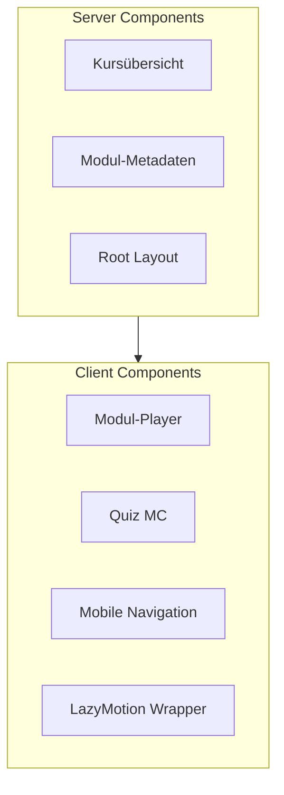

# UX-Implementierung — Apple-Stil & Performance

> **Status:** Verbindlich für Phase B  
> **Version:** 1.0  
> **Datum:** 2026-07-05  
> **Bezug:** [DESIGN-SPEC.md](DESIGN-SPEC.md), [DECISIONS.md](DECISIONS.md) ADR-003, ADR-008, ADR-010

---

## 1. Ziel

Die Plattform soll sich **Apple-inspiriert** anfühlen — nicht durch natives iOS-Chrome, sondern durch HIG-Prinzipien (Klarheit, Deference, Tiefe, Beherrschung) kombiniert mit demenz-freundlichen Anpassungen aus der DESIGN-SPEC.

**Gewählte visuelle Richtung:** Apple-Prinzipien + warmes Demenz-Design (Creme-Hintergrund, System-Fonts, sanfte Schatten). Kein iOS-Clone.

---

## 2. Was wir übernehmen — und was nicht

### Übernehmen

| Prinzip | Umsetzung |
|---------|-----------|
| Deference | UI tritt zurück; Piktogramm, Text, Video im Fokus |
| Klarheit | Eine Hauptaktion pro View (Modul-Schritt, Quiz-Frage) |
| Tiefe | Dezente Schatten (`--shadow-sm` … `--shadow-md`), Karten auf Creme |
| System-Fonts | `-apple-system` first — 0 KB Download, nativ auf Apple-Geräten |
| Touch | Min. 48×48px interaktive Flächen |
| Motion | Sanft, max. 500ms, `prefers-reduced-motion` Pflicht |

### Bewusst nicht übernehmen

| Pattern | Grund |
|---------|-------|
| Liquid Glass / flächendeckender `backdrop-filter` | GPU-Kosten, WCAG-Kontrast, Safari-Inkonsistenz |
| SF Pro / Google Fonts CDN | Lizenz, DSGVO (ADR-008) |
| iOS Tab Bar, Sheets, Large Titles | Erhöht kognitive Last im Schulungs-Flow |
| shadcn / Radix / MUI | Eigene Komponenten (ADR-002, ADR-004) |
| Gesättigte Marketing-Gradients | Demenz-Farbpsychologie (DESIGN-SPEC §1.2.3) |

---

## 3. Technologie-Stack (UX-relevant)

| Bereich | Entscheidung | Referenz |
|---------|--------------|----------|
| Framework | Next.js 15 App Router | ADR-003 |
| Styling | Tailwind CSS + CSS Custom Properties | DESIGN-SPEC §10 |
| Schriften | System-Font-Stack primär | ADR-008 |
| Animation | CSS primär, Framer Motion selektiv | ADR-003, DESIGN-SPEC §8.5 |
| Icons | Lucide React (MIT) oder inline SVG | Dieses Dokument §5 |
| Bilder | `next/image`, WebP, feste Dimensionen | DESIGN-SPEC §6.1 |
| UI-Komponenten | Eigene React-Komponenten | ADR-004 |

---

## 4. Rendering-Architektur



| Bereich | Strategie | Begründung |
|---------|-----------|------------|
| Kursübersicht, Metadaten | Server Components, Static/ISR | Minimales JS, schnelles LCP |
| Modul-Player, Quiz | Client Components | Interaktion, Audio/Video, State |
| Navigation | Server Layout + Client-Island für Mobile | Hydration-Budget schonen |
| Piktogramme | `next/image` mit `width`/`height` | CLS vermeiden |

**Ordnerstruktur:** siehe [ARCHITECTURE.md](ARCHITECTURE.md) §4.

---

## 5. Icons

- **Lucide React** (MIT, tree-shakeable) oder **inline SVG**
- Stil: 1.5–2px Stroke, abgerundete Line-Caps — SF-Symbols-ähnlich ohne Apple-Lizenz
- Kein Icon-Font (Performance, CLS)
- Farbe über `currentColor`, Größe 24×24px Standard (DESIGN-SPEC §5.1.4)

---

## 6. Design Tokens → Code

**Single Source of Truth:** CSS Custom Properties in `src/app/globals.css` (DESIGN-SPEC §10).

Tailwind referenziert die Variablen — keine doppelte Pflege.

```css
/* globals.css — Auszug */
:root {
  --color-primary: #2B5BA8;
  --color-bg-page: #F8F6F1;
  /* vollständige Liste: DESIGN-SPEC §10 */
}
```

```ts
// tailwind.config.ts — Auszug
theme: {
  extend: {
    colors: {
      primary: 'var(--color-primary)',
      'bg-page': 'var(--color-bg-page)',
    },
    borderRadius: {
      md: 'var(--radius-md)',
      lg: 'var(--radius-lg)',
    },
  },
}
```

**DoD:** [DEFINITION-OF-DONE.md](DEFINITION-OF-DONE.md) — „DESIGN-SPEC Tokens in Tailwind“.

---

## 7. Performance-Budget (MVP)

| Metrik | Ziel | Maßnahme |
|--------|------|----------|
| LCP | < 2.5 s | RSC, optimierte Bilder, System-Fonts |
| INP | < 200 ms | CSS-Animationen, kein Main-Thread-Blocking |
| CLS | < 0.1 | Feste Bild-Dimensionen, `min-height` auf Seiten |
| JS First Load | < 100 KB gzipped | Code-Splitting, Lazy Motion |
| Lighthouse Performance | ≥ 90 | Optional CI in Phase B |

Details zur Animations-Hierarchie: DESIGN-SPEC §8.5.

---

## 8. Phase-B-Komponenten-Roadmap

### Woche 1 — Foundation

- [ ] Next.js 15 Scaffold
- [ ] `globals.css` mit allen Tokens + `prefers-reduced-motion`
- [ ] Tailwind-Config mapped auf Tokens
- [ ] Root Layout + Container (DESIGN-SPEC §4)
- [ ] Safe-Area-Insets (DESIGN-SPEC §4.5)

### Woche 1–2 — Primitives

- [ ] Button (Primary, Secondary, Ghost, Icon)
- [ ] Card (Module, Lesson)
- [ ] Input + Label
- [ ] Navigation + Mobile Overlay

### Woche 2 — Features

- [ ] PictogramCard
- [ ] ProgressBar + StepIndicator
- [ ] Quiz (Multiple Choice)
- [ ] Modul-Player-Shell

Jede Komponente strikt nach DESIGN-SPEC §5 — Abweichungen nur mit Spec-Update.

### Referenz-Screens

1. **Kursübersicht** — Card-Grid, großzügiger Weißraum, ein CTA pro Karte
2. **Modul-Schritt** — Pictogramm 128px zentriert, Text max. 720px, Primary-Button unten
3. **Quiz** — eine Frage pro Screen, Antwort-Buttons ≥ 48px, sanftes Semantic-Feedback

---

## 9. Accessibility-Checkliste (vor Merge)

- [ ] Kontrast ≥ 4.5:1 auf allen Text/Hintergrund-Kombinationen
- [ ] Touch-Targets ≥ 48×48px
- [ ] Tastatur-Navigation vollständig (Tab, Enter, Escape)
- [ ] `:focus-visible` auf allen interaktiven Elementen
- [ ] `prefers-reduced-motion` global aktiv
- [ ] ARIA nur wo semantisches HTML nicht reicht
- [ ] VoiceOver/NVDA auf Modul-Player + Quiz getestet
- [ ] 200 % Browser-Zoom ohne Layout-Bruch
- [ ] iPad (768px) manuell getestet

---

## 10. Verwandte Dokumente

| Dokument | Rolle |
|----------|-------|
| [DESIGN-SPEC.md](DESIGN-SPEC.md) | Visuelle Spezifikation (verbindlich) |
| [DECISIONS.md](DECISIONS.md) | Architekturentscheidungen |
| [DEFINITION-OF-DONE.md](DEFINITION-OF-DONE.md) | Abnahmekriterien |
| [ROADMAP.md](ROADMAP.md) | Phasenplan |
| [TEST-STRATEGY.md](TEST-STRATEGY.md) | Automatisierte Tests |

---

## Änderungshistorie

| Version | Datum | Änderung |
|---------|-------|----------|
| 1.0 | 2026-07-05 | Initiales UX-Implementierungsdokument (Apple-Stil-Recherche) |
