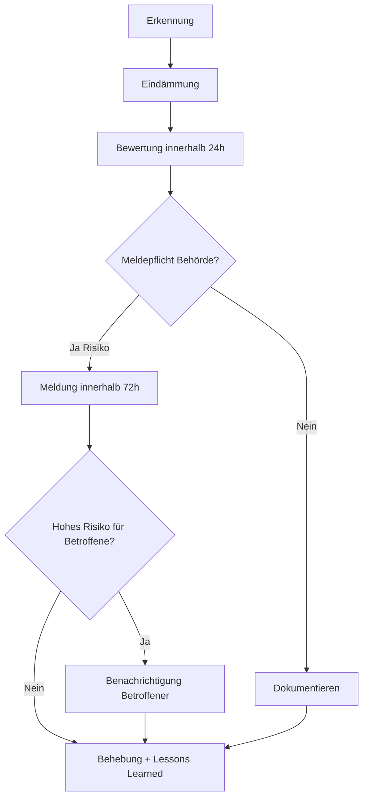

# Incident Response — Datenpannen & Sicherheitsvorfälle

> **Version:** 1.0  
> **Datum:** 2026-07-05  
> **Status:** Operativer Entwurf

---

## 1. Geltungsbereich

- Demenz-Schulungen Prod-App (Hetzner)
- Zugehörige Datenbank und Backups

Nicht im Scope: Winston/Clawdbot (`demenz-prod`) — separates Verfahren bei Bedarf.

---

## 2. Definition Datenpanne (Art. 4 Nr. 12 DSGVO)

Verletzung des Schutzes personenbezogener Daten — z. B. unbefugter Zugriff, Verlust, Offenlegung.

---

## 3. Ablauf

---

## 4. Schritte im Detail

### 4.1 Erkennung

- Automatische Alerts (Logs, Healthcheck-Ausfall)
- Meldung über SECURITY.md Kontakt
- Eigene Beobachtung (Patrick)

### 4.2 Eindämmung (sofort)

- Betroffenen Dienst isolieren (Container stoppen, Firewall-Regel)
- Kompromittierte Credentials rotieren (DB-Passwort, Session-Secret, MiniMax-Key)
- Keine Beweise löschen — Logs sichern

### 4.3 Bewertung (innerhalb 24 Stunden)

Dokumentieren:

| Feld | Inhalt |
|------|--------|
| Datum/Uhrzeit der Entdeckung | |
| Art des Vorfalls | |
| Betroffene Datenkategorien | |
| Anzahl Betroffener (geschätzt) | |
| Wahrscheinliche Folgen | |
| Ursache (vorläufig) | |

### 4.4 Meldung Aufsichtsbehörde (Art. 33)

**Frist: 72 Stunden** ab Kenntnis, wenn Risiko für Rechte und Freiheiten natürlicher Personen.

Inhalt: Art des Vorfalls, Kategorien, ungefähre Anzahl Betroffener, wahrscheinliche Folgen, geplante Maßnahmen, Kontakt Verantwortlicher.

### 4.5 Benachrichtigung Betroffener (Art. 34)

Wenn **hohes Risiko** für Betroffene — ohne unangemessene Verzögerung, in verständlicher Sprache.

### 4.6 Nachbereitung

- Root-Cause-Analyse
- TOMs/ADRs aktualisieren
- CHANGELOG-Eintrag (ohne sensible Details öffentlich)

---

## 5. Kontakte

| Rolle | Kontakt |
|-------|---------|
| Verantwortlicher / Erstes Ansprechpartner | Patrick — `privacy@<PROD-DOMAIN>` |
| Security-Meldungen | `security@<PROD-DOMAIN>` oder gleiche Adresse |
| Aufsichtsbehörde | Nach Sitz des Verantwortlichen — **vor Go-Live eintragen** |

---

## 6. Referenzen

- [../compliance/DATENSCHUTZKONZEPT.md](../compliance/DATENSCHUTZKONZEPT.md) §9
- [../compliance/TOMS.md](../compliance/TOMS.md) §6
- [../SECURITY.md](../SECURITY.md)
